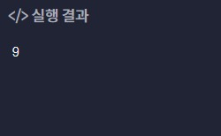
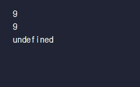

# **java script 기초 정리**

### **코멘트(=주석)**
```javascript
console.log('Hello'); //초록 색 글자가 주석이다.
```
자바스크립트에서는 위 코드와 같이 주석을 달아 줄 때 ```//``` 써서 코딩의 간략한 설명을 메모한 것을 말한다. 여러 줄 코드주석을 할 때는 ```/* */```를 쓴다.   
자바스크립트에서는 세미콜론(;)을 안써도 실행이 되지만 해주는 것이 좋다. 
### **자료형(Data type)**
* 숫자(number)
  - 정수
  - 소수
* 문자열(string)
* 불린(boolean)

### **변수**
변수 선언을 할 때는, 
```javascript
let 변수이름 = 값 ;
```
```let```을 쓰고 위 코드처럼 작성하면 된다.

### **함수**
함수 선언을 할 때는,
```javascript
function 함수이름(파라미터) {
  명령 ;
  명령 ;
};
```
```function```을 쓰고 위 코드처럼 작성하면 된다.   
함수는 정의를 하는 거라서 따로 호출을 해야한다.

함수를 호출 할 떄는
```javascript
함수이름();
```
를 해주면 된다.   
## **기본 틀 작성**
먼저 html파일을 만들고 밑 코드처럼 작성해 준다.
* html
```html
<!DOCTYPE html>
<html lang="ko">

<head>
  <meta charset="utf-8">
  <title>javascript</title>
</head>

<body>
  <script src="./index.js"></script> <!--이 부분이 자바스크립트 연결해주는 코드이다.-->
</body>

</html>
```

그런 다음 위 코드를 보면 index.js라는 자바스크립트 파일을 만들어 주면 된다.   
* javascript
```javascript
console.log('Hello');
```
## **코딩 예시1**

* javascript
```javascript
// 변수선언
let espresso = 10;
let milk = 170;
let chocolateSyrup = 50;
let whippedCream = 60;
// 메뉴별 칼로리 테스트
console.log(espresso); // 에스프레소 칼로리
console.log(espresso + milk); // 라떼 칼로리
console.log(espresso + chocolateSyrup + milk); // 모카 칼로리
console.log(espresso + chocolateSyrup + milk + whippedCream); // 모카(휘핑 추가) 칼로리
```
위 코드에서 변수선언을 먼저 해주고 ```console.log()```로 계산해서 출력한다.   
```javascript
console.log(); //이 코드는 출력하는 코드이다.
```

## **코딩 예시2**
* javascript
```javascript
//반복되는 구간을 함수로 따로 지정해주었다.
function printChorus() {
  console.log('무궁화 삼천리 화려 강산');
  console.log('대한 사람 대한으로 길이 보전하세');
}

// 애국가 가사
console.log('1절');
console.log('동해 물과 백두산이 마르고 닳도록');
console.log('하느님이 보우하사 우리나라 만세');
printChorus();

console.log('2절');
console.log('남산 위에 저 소나무 철갑을 두른 듯');
console.log('바람서리 불변함은 우리 기상일세');
printChorus();

console.log('3절');
console.log('가을 하늘 공활한데 높고 구름 없이');
console.log('밝은 달은 우리 가슴 일편단심일세');
printChorus();

console.log('4절');
console.log('이 기상과 이 맘으로 충성을 다하여');
console.log('괴로우나 즐거우나 나라 사랑하세');
printChorus();
```
위 코드는 애국가 1~4절까지 후렴부분이 반복되므로 따로 함수 선언해줘서 함수 호출을 해주며 애국가 코드를 작성할 수 있다.   

## **코딩 예시3**
* javascript
```javascript
// 체질량지수 구하는 함수
function bmiCalculator(name, kg, height){
  let bmi = kg / (height * height / 10000);
  
  console.log(name + '님의 체질량지수는 ' + bmi +'입니다.');
};

// 테스트
bmiCalculator('홀쭉이', 43.52, 160);
bmiCalculator('코린이', 61.25, 175);
bmiCalculator('통통이', 77.76, 180);
```

함수에서 파라미터를 지정을 하나 이상(없어도 가능)으로 해줄 수 있다.   

## **코딩 예시4 **
* javascript
```javascript
//이자 금액 계산
function interestCalculator(myMoney, saveTerm, interestRate){
  return myMoney * saveTerm * interestRate / 100
}

// 조건 입력 테스트
let myMoney = 3650000; // 맡긴 금액 (원)
let saveTerm = 1; // 맡기는 기간 (년)
let interestRate = 4; // 이자율 (%)

// 수령액 계산 테스트
let myInterest = interestCalculator(myMoney, saveTerm, interestRate);
let totalMoney = myMoney + myInterest;

// 출력 테스트
console.log('맡긴 금액은 ' + myMoney + '원 입니다.');
console.log('이자는 ' + myInterest + '원 입니다.');
console.log('최종 받을 금액은 ' + totalMoney + '원 입니다.');
```

함수부분에 보면 ```return```을 썼다. 이 코드는 반환을 해주는 코드이므로 간편해진 것을 알 수 있다.   
주의 할 점은, 함수 나와서 변수선언을 꼭 해줘야 한다.

## **문자열**
```javascript
console.log("He said \"I'm Iron man\""); //1번

console.log(`He said "I'm Iron man"`); //2번
```
위 코드와 같이 문자안에 따옴표를 쓰고 싶을 땐 두 가지 있다.   
1번을 보면 엔터키 위에 있는 ```\```를 따옴표(")앞에 붙여주는 방법.    
2번을 보면 키보드 위 숫자 1옆에 ` 표시를 문장 전체에 써주는 방법이 있다.

## **템블릿 문자열**
```javascript
let year = 2018;
let month = 3;
let day = 11;

console.log('생년월일은 ' + year + '년 ' + month +'월 ' + day + '일 입니다.' ); //1번
console.log(`생년월일은 ${year}년 ${month}월 ${day}일 입니다.`); //2번
```

위 코드를 보면, 1번처럼 쓰기엔 번거롭고 귀찮은 것을 방지하기 위해 2번을 쓰면 간편하고 코딩의 길이가 짧아지는 것을 확인 할 수 있다.    
```주의 할 점```, 2번을 쓸 때는 키보드 위 숫자 1옆에 ` 이 표시를 써야 $인식이 된다.

## **값이 없다**
값이 없다에는 두 가지 있다.
* null
* undefined   

```null```은 의도적으로 표현할 때 **사용하는 값**을 의미한다.   
```undefined```은 값이 없다는 것을 **확인하는 값**을 의미한다.

## **return vs console.log**
```javascript
function printSquare(x) {
  console.log(x * x);
}


function getSquare(x) {
  return x * x;
}

printSquare(3); //1번
getSquare(3);  //2번
```
위 코드와 같이 실행을 하면 어떤 결과가 나올까?    
일단, 두 함수의 차이점은 console.log와 return의 값이다.   
결과는,    
   
1번만 실행이 되고 2번은 아무런 결과가 나오지 않는 것을 확인 할 수 있다.    

그렇다면, 위 함수는 같고 밑에 코드는 어떤 결과가 나올까?
```javascript
console.log(getSquare(3)); //1번
console.log(printSquare(3)); //2번
```
결과는,   
   
1번은 9가 나오고, 2번은 9가 나왔지만 비워있다는 표시를 나타낸다는 것을 알 수 있다.